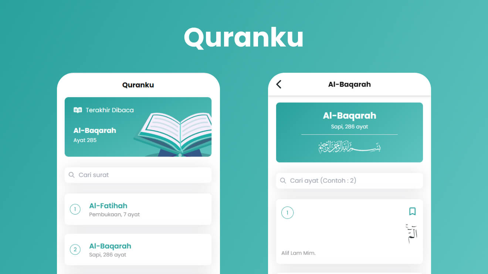

## About Quranku


The sources of Quranku is from: 
- Design App: [Figma - Quranku](https://www.figma.com/file/3dFh788Uk8wWYlhh7Kh62F/Quranku?type=design&node-id=5%3A1567&mode=dev).
- Assets: [Figma - Quran App Concept](https://www.figma.com/community/file/966921639679380402).
- Doa, Dzikir, Teks Arab: Haqq - Quran.
- Data Quran: [Quran JSON](https://github.com/rioastamal/quran-json)

## Features
- **Al-Quran reader** — 114 surah with Arabic text and Indonesian translation, per-surah verse filter.
- **Tafsir** — per-ayah Kemenag tafsir, toggleable.
- **Surah context** — opening/closing notes per surah ("Tentang Surah").
- **Reading settings** — right-slide settings sheet: theme (light/dark), Arabic font size, show/hide translation, tafsir, and surah context.
- **Bookmarks** — save multiple ayat and manage them at `/bookmarks`.
- **Resume reading** — jump back to your last-read ayah; last-read shortcut on the home screen.
- **Juz navigation** — browse all 30 juz at `/juz`.
- **Prayer times & Hijri date** — daily schedule at `/jadwal-sholat` (computed locally with `adhan`, geolocation with city fallback).
- **Qibla compass** — direction to the Kaaba at `/qibla` (device orientation).
- **Audio recitation** — per-ayah playback (Mishary Alafasy via everyayah CDN).
- **Doa harian, Dzikir Pagi/Petang, Teks Arab** — supplications and dhikr collections.

## Getting Started
This is a [Next.js - App Router](https://nextjs.org/) project modernly configured and powered by **Bun** as the package manager and runner, and running on Node LTS.

### Prerequisites
- **Node.js**: `>=24.15.0` (LTS)
- **Bun**: `^1.1.0` (v1.3.13 recommended)

### Installation
Install the dependencies using Bun:
```bash
bun install
```

### Development
Run the development server with hot-reloading (using Next.js Turbopack):
```bash
bun run dev
```

Open [http://localhost:3000](http://localhost:3000) with your browser to see the result.

### Build and Production
Compile the project for production:
```bash
bun run build
```

Start the production server:
```bash
bun run start
```

### Code Quality & Testing
Run ESLint flat checks:
```bash
bun run lint
```

Run the type check:
```bash
bun run typecheck
```

Run the unit tests (Vitest):
```bash
bun run test
```

## Changelog
See [CHANGELOG.md](./CHANGELOG.md) for release notes.
