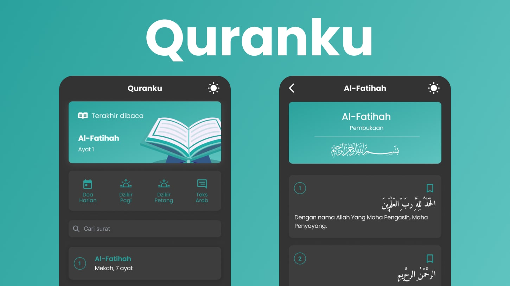

## About Quranku


The design of Quranku is from: 
- Design App: [Figma - Quranku](https://www.figma.com/file/3dFh788Uk8wWYlhh7Kh62F/Quranku?type=design&node-id=5%3A1567&mode=dev)
- Assets: [Figma - Quran App Concept](https://www.figma.com/community/file/966921639679380402).


## Getting Started
This is a [Next.js](https://nextjs.org/) project bootstrapped with [`create-next-app`](https://github.com/vercel/next.js/tree/canary/packages/create-next-app).

First, install the dependencies:
```bash
pnpm install
```

Run the development server:

```bash
pnpm run dev
```

Open [http://localhost:3000](http://localhost:3000) with your browser to see the result.